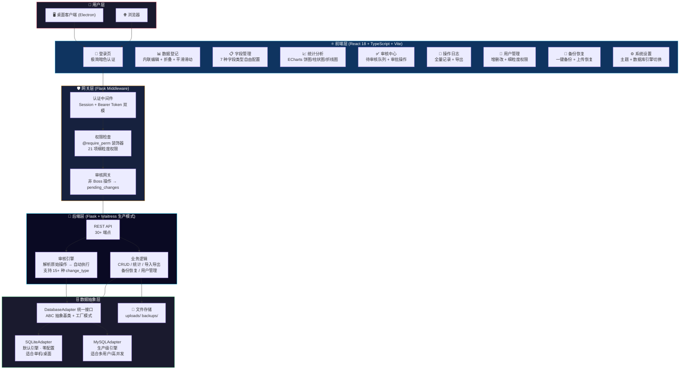
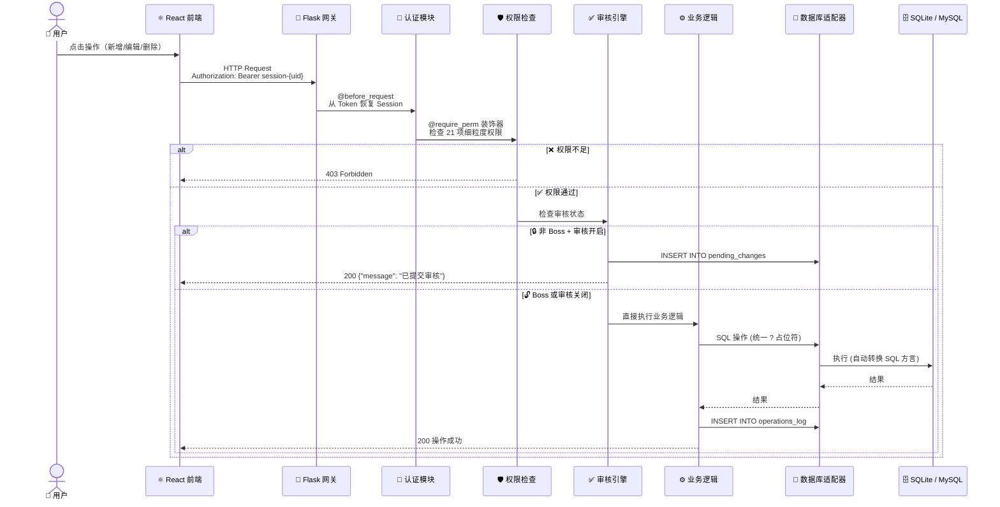
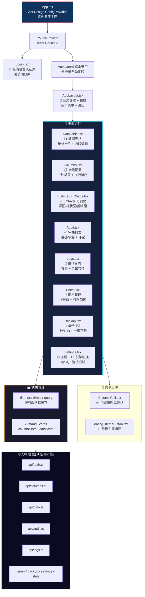
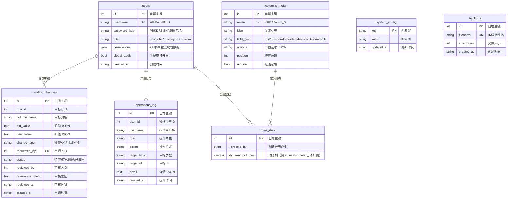
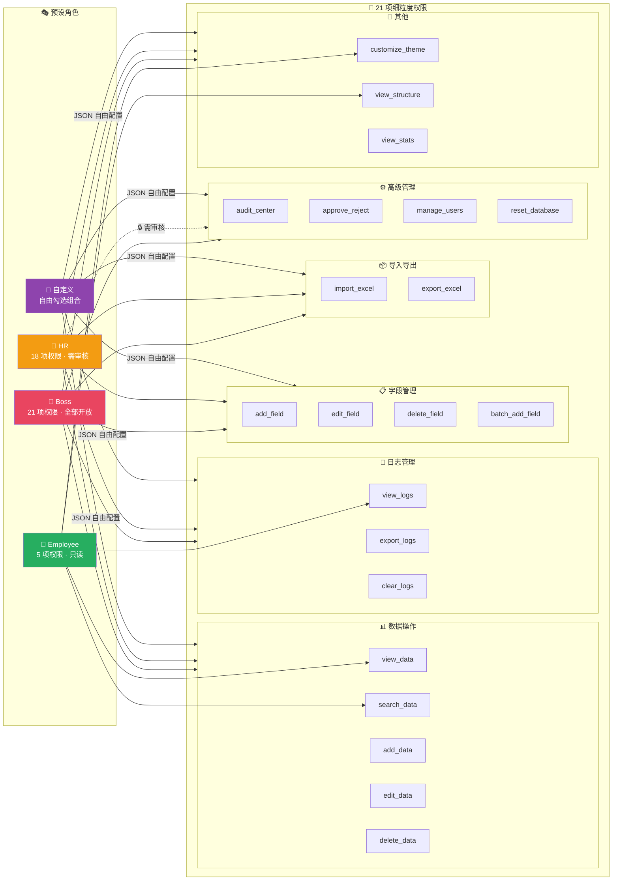
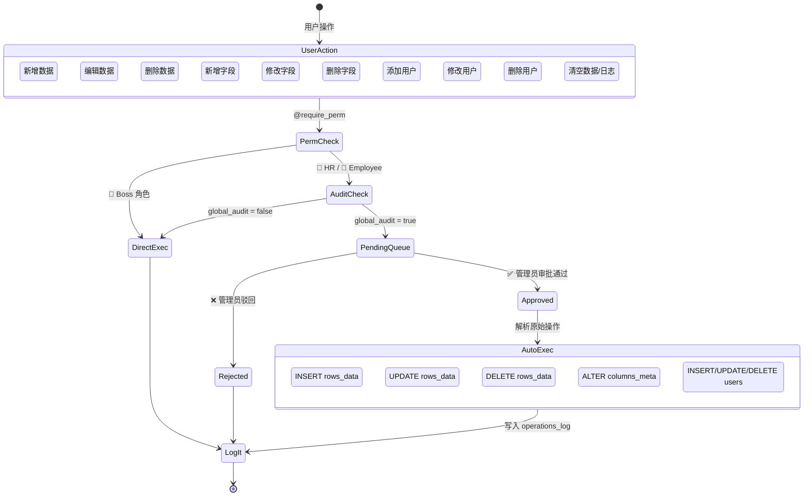
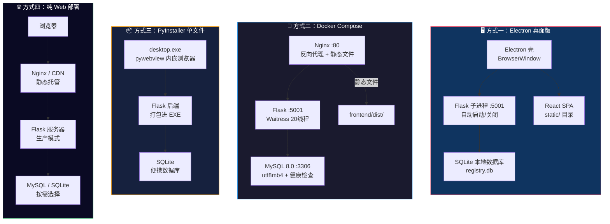

# 🔮 动态数据登记系统 · Dynamic Registry

<p align="center">
  
  
  
  
  
  
</p>

<p align="center">
  <b>一个动态字段、双数据库引擎、三级权限审核的 Web/桌面一体化数据管理平台</b>
</p>

<p align="center">
  <a href="#-系统架构">架构</a> ·
  <a href="#-快速开始">快速开始</a> ·
  <a href="#-项目结构">项目结构</a> ·
  <a href="#-数据库表结构">ER 图</a> ·
  <a href="#-审核工作流">审核流程</a> ·
  <a href="#-部署方案">部署</a> ·
  <a href="#-性能测试">压测</a> ·
  <a href="#-版本历史">版本历史</a>
</p>

---

## 📖 目录

- [系统架构](#-系统架构)
- [功能特性](#-功能特性)
- [技术栈](#-技术栈)
- [请求处理流程](#-请求处理流程)
- [前端组件树](#-前端组件树)
- [数据库表结构 (ER 图)](#-数据库表结构)
- [权限模型](#-权限模型)
- [审核工作流](#-审核工作流)
- [部署架构](#-部署方案)
- [性能测试](#-性能测试)
- [快速开始](#-快速开始)
- [项目结构](#-项目结构)
- [默认账户](#-默认账户)
- [数据库切换](#-数据库切换)
- [打包发布](#-打包发布)
- [版本历史](#-版本历史)
- [FAQ](#-常见问题)
- [License](#-license)

---

## 🏗 系统架构



> 🔍 **设计亮点**：从用户操作到数据库落盘，经过 **认证 → 权限 → 审核** 三层网关，确保每一步都可控、可追溯。

---

## ✨ 功能特性

| 类别 | 功能 | 说明 |
|:---|:---|:---|
| 🔐 **认证授权** | 多角色登录 | Boss / HR / Employee / 自定义 四角色 |
| | 细粒度权限 | 21 项功能点，自由勾选组合 |
| | Session + Token | 双模认证，兼容浏览器 & API 客户端 |
| 📊 **动态数据** | 7 种字段类型 | 文本/数字/日期/下拉/布尔/长文本/文件上传 |
| | 内联编辑 | 表格内直接修改，即时保存 |
| | 分页排序搜索 | 大数据量流畅交互 |
| | 文件上传 | 支持图片/PDF/Office，自动分日期存储 |
| ✅ **审核流** | 全局审核开关 | 每个用户独立控制 |
| | 待审核队列 | 支持 15+ 种操作类型审核 |
| | 自动执行 | 审批通过后自动解析原始操作并执行 |
| 📈 **统计分析** | ECharts 可视化 | 饼图/柱状图/折线图 |
| | 按字段统计 | 任意字段自由统计 |
| 🗄️ **数据库** | SQLite + MySQL | 双引擎无缝切换，一行配置 |
| | 统一适配层 | DatabaseAdapter ABC 抽象，? 占位符统一 |
| 📦 **导入导出** | Excel 导入 | 智能识别表头，自动创建字段 |
| | Excel 导出 | 紫色渐变表头，专业格式 |
| | 备份恢复 | 一键备份 DB 文件，上传恢复 |
| 📝 **审计日志** | 全量记录 | 所有操作不可篡改 |
| | 导出 TXT | UTF-8 BOM 编码，Excel 友好 |
| 🖥️ **多端部署** | Electron 桌面 | Windows/macOS/Linux 原生窗口 |
| | Docker Compose | 一键启动 MySQL + Flask + Nginx |
| | PyInstaller | 单 EXE 交付 |

---

## 🛠️ 技术栈

| 层级 | 技术 | 版本 |
|:---|:---|:---:|
| **前端框架** | React + TypeScript | 18.x |
| **UI 组件库** | Ant Design | 5.x |
| **样式方案** | TailwindCSS + CSS Modules | — |
| **状态管理** | Zustand | — |
| **数据请求** | TanStack Query (React Query) | — |
| **图表可视化** | ECharts | — |
| **路由** | React Router | v6 |
| **构建工具** | Vite | — |
| **后端框架** | Flask | 3.x |
| **生产服务器** | Waitress | 20 线程 / 150+ 并发 |
| **数据库** | SQLite / MySQL 8.0 | 双引擎适配层 |
| **桌面壳** | Electron | 28.x |
| **打包** | electron-builder / PyInstaller / Inno Setup | — |
| **容器化** | Docker + docker-compose | — |
| **压测** | Locust | — |

---

## 🔄 请求处理流程



---

## 🌳 前端组件树



---

## 🗄️ 数据库表结构



---

## 🔐 权限模型



---

## ✅ 审核工作流



---

## 🚀 部署方案



---

## ⚡ 性能测试

使用 **Locust** 对核心 API 进行压力测试（本地开发环境，SQLite 模式）。

### 测试环境

| 项目 | 配置 |
|:---|:---|
| 并发用户 | 170 |
| 总请求数 | 2,100+ |
| 失败率 | **0%** |
| 聚合 RPS | **39.4** |

### 核心接口表现

| 接口 | 请求数 | Median | 95%ile | 99%ile | Average | 失败 |
|:---|---:|---:|---:|---:|---:|---:|
| `GET /api/health` | 72 | 3 ms | 16 ms | 22 ms | 4.35 ms | 0 |
| `GET /api/audit/count` | 64 | 24 ms | 65 ms | 140 ms | 30.77 ms | 0 |
| `GET /api/columns` | 746 | 31 ms | 110 ms | 140 ms | 38.36 ms | 0 |
| `GET /api/rows` | 746 | 32 ms | 95 ms | 160 ms | 39.82 ms | 0 |
| `GET /api/stats/fields` | 200 | 33 ms | 110 ms | 190 ms | 38.64 ms | 0 |
| `GET /api/me` | 117 | 33 ms | 85 ms | 110 ms | 36.79 ms | 0 |
| `GET /api/logs` | 57 | 36 ms | 120 ms | 130 ms | 44.22 ms | 0 |
| `POST /api/login` | 98 | 130 ms | 220 ms | 270 ms | 141.08 ms | 0 |
| **Aggregated** | **2,100** | **32 ms** | **120 ms** | **190 ms** | **42.38 ms** | **0** |

> 测试命令：`locust -f locustfile.py --host=http://127.0.0.1:5001`

<p align="center">
  
</p>

---

## 🚀 快速开始

### 方式一：一键脚本（推荐新手）

**Windows**
```bash
双击 启动.bat，自动检测 Python 环境并安装依赖
```

**macOS / Linux**
```bash
chmod +x start.sh
./start.sh
```

### 方式二：Docker Compose（推荐生产）

```bash
# 1. 配置环境变量
cp .env.example .env
# 编辑 .env 修改数据库密码等

# 2. 一键启动（MySQL + Flask + Nginx）
docker-compose up -d

# 3. 查看日志
docker-compose logs -f backend

# 4. 浏览器打开
# http://localhost
```

### 方式三：手动开发模式

**后端**
```bash
pip install -r requirements.txt
pip install -r backend/requirements.txt
python app.py
# 后端运行在 http://localhost:5001
```

**前端**
```bash
cd frontend
npm install
npm run dev
# 前端运行在 http://localhost:3000（自动代理 API 到 5001）
```

**Electron 桌面版**
```bash
# 先启动后端，再运行：
cd electron
npm install
npx tsc
npx electron dist/main.js
```

---

## 📁 项目结构

```
dynamic_registry/
├── app.py                      # 🐍 Flask 后端主入口（1618 行）
├── run.py                      # 🚀 开发启动脚本
├── requirements.txt            # 📦 Python 依赖
├── registry.db                 # 🗄️ SQLite 数据库（默认）
│
├── backend/                    # 🔧 后端核心模块
│   ├── config.py               # ⚙️ 配置管理（.env 读取）
│   ├── db_adapter.py           # 🔌 数据库适配层
│   │   ├── DatabaseAdapter     #    ABC 抽象基类
│   │   ├── SQLiteAdapter       #    SQLite 实现
│   │   └── MySQLAdapter        #    MySQL 实现
│   ├── test_adapter.py         # 🧪 适配器单元测试
│   └── requirements.txt        # 📦 后端依赖
│
├── frontend/                   # ⚛️ React 前端
│   ├── src/
│   │   ├── api/                # 🌐 API 客户端（自动检测 Electron 环境）
│   │   ├── components/         # 🧩 公共组件
│   │   │   ├── AppLayout.tsx   #    主布局（侧栏 + 顶栏）
│   │   │   └── EditableCell.tsx#    内联编辑单元格
│   │   ├── pages/              # 📄 页面组件
│   │   │   ├── Login.tsx       #    登录页
│   │   │   ├── DataTable.tsx   #    数据登记页
│   │   │   ├── Columns.tsx     #    字段管理页
│   │   │   ├── Stats.tsx       #    统计分析页
│   │   │   ├── Audit.tsx       #    审核中心
│   │   │   ├── Logs.tsx        #    操作日志
│   │   │   ├── Users.tsx       #    用户管理
│   │   │   └── Settings.tsx    #    系统设置
│   │   ├── stores/             # 🗃️ Zustand 状态管理
│   │   ├── styles/             # 🎨 紫色渐变主题
│   │   ├── types/              # 📐 TypeScript 类型
│   │   └── router/             # 🧭 路由配置
│   ├── vite.config.ts          # ⚡ Vite 构建配置
│   ├── nginx.conf              # 🌐 Nginx 反向代理
│   └── Dockerfile              # 🐳 前端镜像
│
├── electron/                   # 🖥️ Electron 桌面壳
│   ├── src/
│   │   ├── main.ts             # 主进程（Flask 子进程管理）
│   │   └── preload.ts          # 预加载脚本
│   ├── electron-builder.yml    # 打包配置
│   └── package.json
│
├── static/                     # 📦 编译后的前端静态文件
├── templates/                  # 🧩 Flask Jinja2 模板
├── data/                       # 💾 数据存档
├── backups/                    # 💿 数据库备份目录
│
├── docker-compose.yml          # 🐳 Docker 编排
├── Dockerfile                  # 🐳 容器镜像
├── start.bat                   # 🪟 Windows 启动脚本
├── start.sh                    # 🍎 macOS/Linux 启动脚本
│
├── 架构图.md                   # 📐 架构设计文档
├── 更新公告.md                 # 📋 版本迭代记录
└── README.md                   # 📖 本文件
```

---

## 👤 默认账户

| 用户名 | 密码 | 角色 | 权限说明 |
|:---|:---|:---|:---|
| `boss` | `123456` | 👑 Boss | 21 项权限 · 无需审核 |
| `hr` | `123456` | 👔 HR | 18 项权限 · 高级操作需审核 |
| `employee` | `123456` | 👤 Employee | 5 项权限 · 只读查看 |

> ⚠️ **首次登录后请立即修改密码！**

---

## 🗄️ 数据库切换

### SQLite（默认）
零配置，启动即用。数据库文件存储在 `registry.db`。

### MySQL（生产推荐）

```sql
-- 1. 创建数据库和用户
CREATE DATABASE app_db CHARACTER SET utf8mb4 COLLATE utf8mb4_unicode_ci;
CREATE USER 'appuser'@'%' IDENTIFIED BY 'apppass123';
GRANT ALL ON app_db.* TO 'appuser'@'%';
FLUSH PRIVILEGES;
```

```bash
# 2. 创建 backend/.env
DB_ENGINE=mysql
MYSQL_HOST=localhost
MYSQL_PORT=3306
MYSQL_USER=appuser
MYSQL_PASSWORD=apppass123
MYSQL_DATABASE=app_db
```

> 💡 适配器会自动将 SQLite 方言转换为 MySQL 语法（`AUTOINCREMENT → AUTO_INCREMENT`、`TEXT → VARCHAR(255)` 等）。

---

## 📦 打包发布

| 平台 | 命令 | 输出 |
|:---|:---|:---|
| 🪟 Windows | `npm run package:win` | `动态数据登记系统 Setup.exe` |
| 🍎 macOS | `npm run package:mac` | `动态数据登记系统.dmg` |
| 🐧 Linux | `npm run package:linux` | `动态数据登记系统.AppImage` |

---

## 📜 版本历史

| 版本 | 日期 | 类型 | 内容 |
|:---|:---|:---:|:---|
| v0.1-alpha | 07-19 | ✅ | MVP：Flask + SQLite + 原生 HTML，7 种字段，基础 CRUD |
| v0.2-alpha | 07-20 | ✅ | 启动脚本自动检测 Python 环境 |
| v0.3-alpha | 07-20 | ✅ | 自定义颜色面板，localStorage 持久化 |
| v1.0-beta | 07-20 | ✅ | 权限系统：3 角色 + 登录/登出 |
| v1.1-beta | 07-20 | ✅ | 审核机制：pending_changes + 审批流程 |
| v1.2-beta | 07-21 | ✅ | 操作日志全量记录 + 导出 |
| v1.3-beta | 07-21 | 🐛 | 修复登录遮罩不显示 |
| v1.4-beta | 07-21 | ✅ | 桌面化封装：pywebview 独立窗口 |
| v2.0-rc | 07-21 | ✅ | 21 项细粒度权限 + 自定义角色 |
| v2.1-rc | 07-21 | ✅ | 用户管理：增删改 + 权限组合 |
| v2.2-rc | 07-21 | ✅ | ECharts 统计看板 |
| v2.3-rc | 07-22 | 🐛 | 修复字段删除/数据编辑 |
| v2.4-rc | 07-22 | ✅ | 数据库备份恢复 |
| v2.6-rc | 07-22 | ✅ | 用户协议 + 隐私政策 |
| v2.7-rc | 07-22 | ✅ | 全局审核开关（独立控制） |
| v2.8-rc | 07-22 | 🔧 | 字段管理改为表格列表 |
| v2.9-rc | 07-22 | 🔧 | 数据表格折叠 + 惯性滑动 |
| **v3.0** | **07-22** | 🚀 | **正式版：完整功能 + EXE 安装包交付** |

> 📊 **迭代统计**：20 个版本 · 15 项新增 · 2 项修复 · 2 项优化 · 4 天完成 MVP → 正式版

---

## ❓ 常见问题

<details>
<summary><b>Q: 启动报 ModuleNotFoundError</b></summary>

```bash
pip install -r requirements.txt && pip install -r backend/requirements.txt
```
</details>

<details>
<summary><b>Q: 前端页面白屏</b></summary>

检查浏览器控制台 CORS 错误，确认后端运行在 5001 端口。
</details>

<details>
<summary><b>Q: Electron 显示"后端无响应"</b></summary>

确认 Python 已安装并加入 PATH，5001 端口未被占用。
</details>

<details>
<summary><b>Q: MySQL 连接失败</b></summary>

确认 MySQL 服务运行中，用户密码正确，防火墙放行 3306。可在系统设置中点击"测试连接"。
</details>

<details>
<summary><b>Q: Docker 启动失败</b></summary>

检查 3306 / 5001 / 80 端口是否被占用，修改 `docker-compose.yml` 端口映射。
</details>

<details>
<summary><b>Q: Excel 导入字段不匹配</b></summary>

系统会自动检测表头并创建字段。确保 Excel 第一行为列名，系统会自动跳过标题行。
</details>

<details>
<summary><b>Q: macOS 运行 .app 被拦截</b></summary>

系统设置 → 隐私与安全 → 点击"仍要打开"。
</details>

---

## 📄 License

MIT License · Copyright (c) 2026 Jincheng3870682453-hash

---

<p align="center">
  <sub>Built with ❤️ using Flask + React + Electron</sub>
</p>
