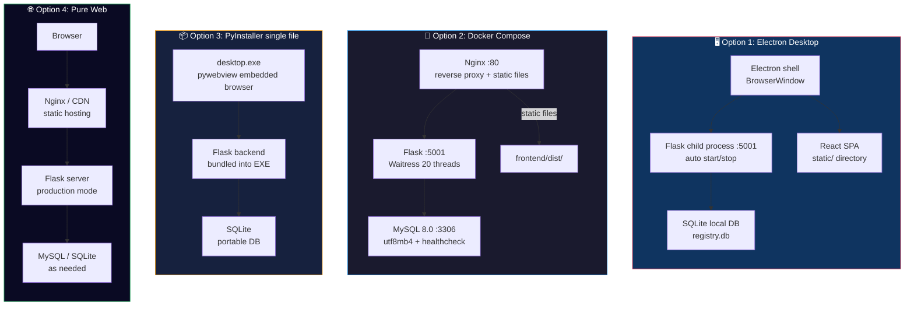

# 🔮 Dynamic Registry System · 动态数据登记系统

<p align="center">
  
  
  
  
  
  
</p>

<p align="center">
  <a href="README.md">中文</a> · <a href="README_EN.md"><b>English</b></a>
</p>

<p align="center">
  <b>A unified Web/Desktop data management platform with dynamic fields, dual database engines, and three-level permission & audit workflow.</b>
</p>

---

## 📖 Table of Contents

- [Features](#-features)
- [Tech Stack](#-tech-stack)
- [Deployment Options](#-deployment-options)
- [Performance](#-performance)
- [Quick Start](#-quick-start)
- [Project Structure](#-project-structure)
- [Default Accounts](#-default-accounts)
- [Database Switching](#-database-switching)
- [Packaging](#-packaging)
- [FAQ](#-faq)
- [License](#-license)

> 📚 Detailed architecture diagrams, DB schema (ER), permission model, audit workflow, changelogs and legal documents are available in the [Chinese README](README.md).

---

## ✨ Features

| Category | Feature | Description |
|:---|:---|:---|
| 🔐 **Auth** | Multi-role login | Boss / HR / Employee / Custom roles |
| | Fine-grained permissions | 21 permission points, freely combinable |
| | Session + Token | Dual auth, works with browser & API clients |
| 📊 **Dynamic data** | 7 field types | Text / Number / Date / Dropdown / Boolean / Long text / File upload |
| | Inline editing | Edit directly in the table, saved instantly |
| | Pagination / sorting / search | Smooth interaction with large datasets |
| | File upload | Images / PDF / Office, auto-sorted by date |
| ✅ **Audit flow** | Global audit switch | Controlled independently per user |
| | Pending queue | 15+ operation types under audit |
| | Auto-execution | Parses and executes the original operation after approval |
| 📈 **Analytics** | ECharts visualization | Pie / bar / line charts |
| | Field-based stats | Any field, freely aggregated |
| 🤖 **AI analysis** | Multi-model | DeepSeek / OpenAI / Qwen / ERNIE / custom |
| | Conversational analysis | Natural-language questions, reports + multi-turn follow-ups |
| | Streaming output | Watch the AI analysis process in real time |
| | Voice input | Web Speech API speech-to-text |
| | History | Reports & conversations saved per user |
| 🎨 **Themes** | 9 background textures | Glass / Frosted / Metal / Paper / Neon / Liquid grid / Depth / Transparent / Minimal flat |
| | 4-color palette | Brand accent, background, card background, text color |
| | Per-user isolation | Theme stored independently, restored on login |
| 🗄️ **Database** | SQLite + MySQL | Seamless switch between engines, one-line config |
| | Unified adapter | `DatabaseAdapter` ABC abstraction, unified `?` placeholders |
| 📦 **Import/Export** | Excel import | Smart header detection, auto field creation |
| | Excel export | Purple gradient header, professional format |
| | Backup/restore | One-click DB backup, upload to restore |
| 📝 **Audit log** | Full logging | All operations, tamper-proof |
| | TXT export | UTF-8 BOM, Excel-friendly |
| 🖥️ **Multi-platform** | Electron desktop | Native windows for Windows / macOS / Linux |
| | Docker Compose | One-command MySQL + Flask + Nginx |
| | PyInstaller | Single-EXE delivery |

---

## 🛠️ Tech Stack

| Layer | Technology | Version |
|:---|:---|:---:|
| **Frontend framework** | React + TypeScript | 18.x |
| **UI library** | Ant Design | 5.x |
| **Styling** | TailwindCSS + CSS Modules | — |
| **State** | Zustand | — |
| **Data fetching** | TanStack Query (React Query) | — |
| **Charts** | ECharts | — |
| **Routing** | React Router | v6 |
| **Build** | Vite | — |
| **Backend framework** | Flask | 3.x |
| **Production server** | Waitress | 20 threads / 150+ concurrency |
| **Database** | SQLite / MySQL 8.0 | dual-engine adapter |
| **Desktop shell** | Electron | 28.x |
| **Packaging** | electron-builder / PyInstaller / Inno Setup | — |
| **Containerization** | Docker + docker-compose | — |
| **Load testing** | Locust | — |

---

## 🚀 Deployment Options



---

## ⚡ Performance

Load-tested with **Locust** against the core APIs (local dev, SQLite mode).

### Test environment

| Item | Value |
|:---|:---|
| Concurrent users | 170 |
| Total requests | 2,100+ |
| Failure rate | **0%** |
| Aggregated RPS | **39.4** |

### Core endpoints

| Endpoint | Requests | Median | 95%ile | 99%ile | Average | Failures |
|:---|---:|---:|---:|---:|---:|---:|
| `GET /api/health` | 72 | 3 ms | 16 ms | 22 ms | 4.35 ms | 0 |
| `GET /api/audit/count` | 64 | 24 ms | 65 ms | 140 ms | 30.77 ms | 0 |
| `GET /api/columns` | 746 | 31 ms | 110 ms | 140 ms | 38.36 ms | 0 |
| `GET /api/rows` | 746 | 32 ms | 95 ms | 160 ms | 39.82 ms | 0 |
| `GET /api/stats/fields` | 200 | 33 ms | 110 ms | 190 ms | 38.64 ms | 0 |
| `GET /api/me` | 117 | 33 ms | 85 ms | 110 ms | 36.79 ms | 0 |
| `GET /api/logs` | 57 | 36 ms | 120 ms | 130 ms | 44.22 ms | 0 |
| `POST /api/login` | 98 | 130 ms | 220 ms | 270 ms | 141.08 ms | 0 |
| **Aggregated** | **2,100** | **32 ms** | **120 ms** | **190 ms** | **42.38 ms** | **0** |

> Run it yourself: `locust -f locustfile.py --host=http://127.0.0.1:5001`

<p align="center">
  
</p>

---

## 🚀 Quick Start

### Option 1: One-click script (recommended for beginners)

**Windows**
```bash
Double-click 启动.bat — it auto-detects Python and installs dependencies.
```

**macOS / Linux**
```bash
chmod +x start.sh
./start.sh
```

### Option 2: Docker Compose (recommended for production)

```bash
# 1. Configure environment
cp .env.example .env
# edit .env to change DB passwords, etc.

# 2. One-command startup (MySQL + Flask + Nginx)
docker-compose up -d

# 3. Follow logs
docker-compose logs -f backend

# 4. Open the browser
# http://localhost
```

### Option 3: Manual dev mode

**Backend**
```bash
pip install -r requirements.txt
pip install -r backend/requirements.txt
python app.py
# backend runs at http://localhost:5001
```

**Frontend**
```bash
cd frontend
npm install
npm run dev
# frontend runs at http://localhost:3000 (proxies API to 5001)
```

**Electron desktop**
```bash
# start the backend first, then:
cd electron
npm install
npx tsc
npx electron dist/main.js
```

---

## 📁 Project Structure

```
dynamic_registry/
├── app.py                      # 🐍 Flask backend entry (2060 lines)
├── run.py                      # 🚀 dev startup script
├── requirements.txt            # 📦 Python dependencies
├── registry.db                 # 🗄️ SQLite database (default)
│
├── backend/                    # 🔧 backend core modules
│   ├── config.py               # ⚙️ config (.env loading)
│   ├── db_adapter.py           # 🔌 DB adapter layer
│   │   ├── DatabaseAdapter     #    ABC abstract base
│   │   ├── SQLiteAdapter       #    SQLite implementation
│   │   └── MySQLAdapter        #    MySQL implementation
│   ├── ai_client.py            # 🤖 multi-model AI client (DeepSeek/OpenAI/Qwen/ERNIE/custom)
│   ├── db_crypto.py            # 🔐 data encryption module
│   ├── test_adapter.py         # 🧪 adapter unit tests
│   └── requirements.txt        # 📦 backend deps
│
├── frontend/                   # ⚛️ React frontend
│   ├── src/
│   │   ├── api/                # 🌐 API client (auto-detects Electron)
│   │   ├── components/         # 🧩 shared components
│   │   │   ├── AppLayout.tsx   #    main layout (sidebar + header)
│   │   │   ├── EditableCell.tsx#    inline-edit cell
│   │   │   └── FloatingThemeButton.tsx  #   🎨 floating theme switch
│   │   ├── pages/              # 📄 pages
│   │   │   ├── Login.tsx       #    login
│   │   │   ├── DataTable.tsx   #    data registry
│   │   │   ├── Columns.tsx     #    field management
│   │   │   ├── Stats.tsx       #    analytics
│   │   │   ├── Audit.tsx       #    audit center
│   │   │   ├── Logs.tsx        #    operation logs
│   │   │   ├── Users.tsx       #    user management
│   │   │   ├── AIAnalysis.tsx  #    AI data analysis
│   │   │   └── Settings.tsx    #    system settings
│   │   ├── stores/             # 🗃️ Zustand state
│   │   ├── styles/             # 🎨 theme textures (textures.css, 9 textures + CSS vars)
│   │   ├── types/              # 📐 TypeScript types
│   │   └── router/             # 🧭 routing
│   ├── vite.config.ts          # ⚡ Vite config
│   ├── nginx.conf              # 🌐 Nginx reverse proxy
│   └── Dockerfile              # 🐳 frontend image
│
├── electron/                   # 🖥️ Electron desktop shell
│   ├── src/
│   │   ├── main.ts             # main process (Flask child process mgmt)
│   │   └── preload.ts          # preload script
│   ├── electron-builder.yml    # packaging config
│   └── package.json
│
├── static/                     # 📦 compiled frontend assets
├── templates/                  # 🧩 Flask Jinja2 templates
├── data/                       # 💾 data archive
├── backups/                    # 💿 DB backup directory
│
├── docker-compose.yml          # 🐳 Docker orchestration
├── Dockerfile                  # 🐳 container image
├── start.bat                   # 🪟 Windows launcher
├── start.sh                    # 🍎 macOS/Linux launcher
│
├── 架构图.md                   # 📐 architecture doc (Chinese)
├── 更新公告.md                 # 📋 changelog (Chinese)
└── README.md                   # 📖 this file
```

---

## 👤 Default Accounts

| Username | Password | Role | Permissions |
|:---|:---|:---|:---|
| `boss` | `123456` | 👑 Boss | 21 permissions · no audit needed |
| `hr` | `123456` | 👔 HR | 18 permissions · advanced ops need audit |
| `employee` | `123456` | 👤 Employee | 5 permissions · read-only |

> ⚠️ **Change the passwords immediately after first login!**

---

## 🗄️ Database Switching

### SQLite (default)
Zero config, works out of the box. The DB file lives at `registry.db`.

### MySQL (recommended for production)

```sql
-- 1. Create database and user
CREATE DATABASE app_db CHARACTER SET utf8mb4 COLLATE utf8mb4_unicode_ci;
CREATE USER 'appuser'@'%' IDENTIFIED BY 'apppass123';
GRANT ALL ON app_db.* TO 'appuser'@'%';
FLUSH PRIVILEGES;
```

```bash
# 2. Create backend/.env
DB_ENGINE=mysql
MYSQL_HOST=localhost
MYSQL_PORT=3306
MYSQL_USER=appuser
MYSQL_PASSWORD=apppass123
MYSQL_DATABASE=app_db
```

> 💡 The adapter auto-converts SQLite dialect to MySQL (`AUTOINCREMENT → AUTO_INCREMENT`, `TEXT → VARCHAR(255)`, etc.).

---

## 📦 Packaging

| Platform | Command | Output |
|:---|:---|:---|
| 🪟 Windows | `npm run package:win` | `动态数据登记系统 Setup.exe` |
| 🍎 macOS | `npm run package:mac` | `动态数据登记系统.dmg` |
| 🐧 Linux | `npm run package:linux` | `动态数据登记系统.AppImage` |

---

## ❓ FAQ

<details>
<summary><b>Q: ModuleNotFoundError on startup</b></summary>

```bash
pip install -r requirements.txt && pip install -r backend/requirements.txt
```
</details>

<details>
<summary><b>Q: Frontend shows a blank page</b></summary>

Check the browser console for CORS errors and make sure the backend runs on port 5001.
</details>

<details>
<summary><b>Q: Electron says "backend not responding"</b></summary>

Make sure Python is installed and on PATH, and port 5001 is not occupied.
</details>

<details>
<summary><b>Q: MySQL connection failed</b></summary>

Make sure MySQL is running, the user/password are correct, and port 3306 is open in the firewall. You can click "Test connection" in Settings.
</details>

<details>
<summary><b>Q: Docker startup failed</b></summary>

Check whether ports 3306 / 5001 / 80 are occupied; adjust the port mapping in `docker-compose.yml`.
</details>

<details>
<summary><b>Q: Excel import fields don't match</b></summary>

The system auto-detects headers and creates fields. Make sure the first row of the Excel file contains column names; title rows are skipped automatically.
</details>

<details>
<summary><b>Q: macOS blocks the .app</b></summary>

System Settings → Privacy & Security → click "Open Anyway".
</details>

---

## 📄 License

**PolyForm Noncommercial License 1.0.0** · Copyright (c) 2026 Jincheng3870682453-hash

> **Allowed**: viewing, learning, research, personal use, noncommercial modification & distribution
> **Prohibited**: any commercial use (selling, providing paid services)
>
> 📧 **Commercial licensing**: contact the author at **3870682453@qq.com** (primary, fast replies) or jincheng3870682453@gmail.com (backup) — describe your use case and authorization will be granted upon approval.
> You can also reach out via [GitHub Issues](https://github.com/jincheng3870682453-hash/shujuku/issues).

---

<p align="center">
  <sub>Built with ❤️ using Flask + React + Electron</sub>
</p>
