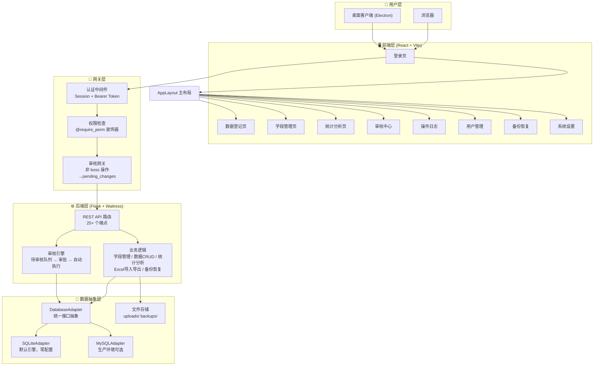
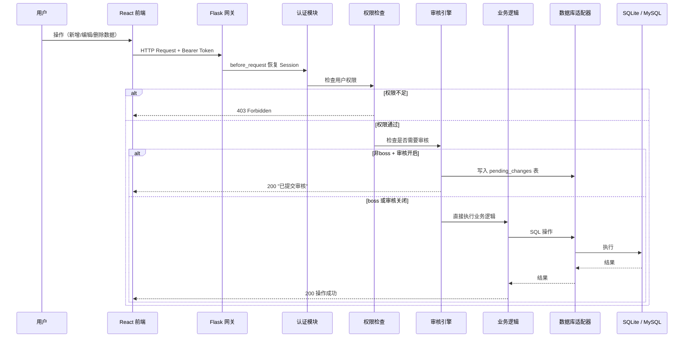
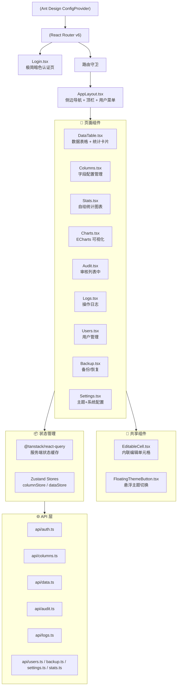
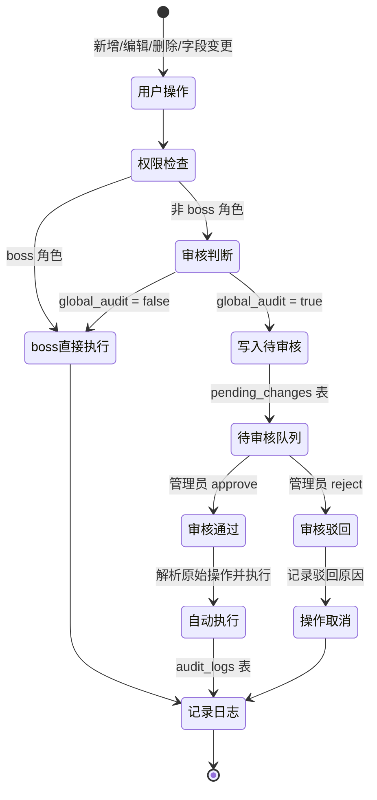
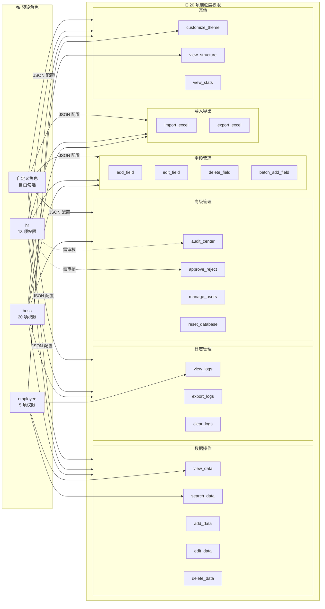

# 对话记录 - 2025年7月25日

---

## 项目概述：动态数据登记系统

### 这是什么项目？

**动态数据登记系统**（Dynamic Registry）是一个通用的、可自定义字段的数据登记与管理平台。简单来说，它是一个 **"可自建表的轻量级数据库前端"**——用户不需要懂数据库，就能动态创建任意结构的登记表，并录入、查询、统计数据。

### 典型应用场景

- 员工花名册 / 人事档案管理
- 项目台账 / 合同登记
- 固定资产登记
- 客户信息管理
- 任何需要"自定义表格"的数据登记需求

### 技术栈

| 层次 | 技术 |
|------|------|
| **后端** | Flask (Python)，端口 5001，生产模式 Waitress（20线程） |
| **前端** | React 18 + TypeScript + Vite 构建 |
| **UI 组件库** | Ant Design 5（暗色主题深度定制） |
| **状态管理** | @tanstack/react-query + Zustand |
| **图表** | ECharts（饼图/柱状图/折线图） |
| **数据库** | SQLite（默认）/ MySQL（可选切换），通过适配层统一抽象 |
| **认证** | PBKDF2-SHA256 密码哈希 + Session Token |
| **桌面打包** | Electron（NSIS 安装包） / PyInstaller + pywebview |
| **服务器部署** | Docker Compose（Nginx + Flask） |

### 核心功能

1. **动态字段管理** — 自由添加/删除/重命名字段，支持文本、数字、日期、下拉选择、布尔、长文本、文件上传 7 种类型
2. **数据 CRUD** — 增删改查 + 分页 + 搜索 + 排序
3. **Excel 导入/导出** — 批量导入数据（自动识别字段），一键导出 .xlsx
4. **统计可视化** — 按任意字段统计，ECharts 图表展示（饼图/柱状图/折线图）
5. **审核工作流** — 敏感操作需管理员审批，审核通过后自动执行
6. **操作日志** — 完整记录所有操作的审计日志，支持导出
7. **数据库备份/恢复** — 本地备份管理 + 上传恢复
8. **用户与权限** — 多角色（boss/hr/employee），20 项细粒度权限控制，支持自定义角色
9. **数据权限隔离** — 非管理员只能看到自己创建的数据

### 用户角色体系

| 角色 | 默认权限数 | 说明 |
|------|-----------|------|
| **boss**（管理员） | 全部 20 项 | 无限制，不经过审核 |
| **hr**（人事） | 18 项 | 大部分功能，操作需审核 |
| **employee**（员工） | 5 项 | 仅查看/搜索/主题定制 |

默认账户：`boss` / `hr` / `employee`，密码均为 `123456`

### 架构亮点

- **数据库抽象层**：通过 `DatabaseAdapter` 基类统一 SQLite 和 MySQL 接口，切换数据库只需改配置
- **动态表结构**：字段元数据存在 `columns_meta`，`rows_data` 表通过 `ALTER TABLE ADD COLUMN` 动态扩展
- **审核流水线**：非 boss + 审核开启时，操作先写入 `pending_changes`，审批通过后统一执行
- **前端主题系统**：支持 Glass / Neon / Flat 等多种 UI 质感，74 个设计 Token
- **AI 辅助开发**：4 天完成 20 个版本迭代（alpha → beta → rc → v3.0 正式版）

### 当前版本

v3.0 正式版（2026-07-22）

### 项目目录结构

```
dynamic_registry/
├── app.py                 # Flask 主应用（~1618行）
├── backend/               # 后端核心（db_adapter, config）
├── frontend/src/          # React 前端（pages/components/stores/api/styles）
├── electron/              # Electron 桌面打包
├── static/                # 前端构建产物 + 上传文件
├── backups/               # 数据库备份
└── 文档/                  # 更新公告、用户协议、隐私政策
```

---

## 架构图

### 1. 系统总体架构



### 2. 请求处理流程



### 3. 前端组件树



### 4. 数据库表结构 (ER 图)

```mermaid
erDiagram
    users {
        int id PK
        string username
        string password_hash
        string role
        json permissions
        bool global_audit
    }

    columns_meta {
        int id PK
        string name
        string label
        string field_type
        string options
        int order
        bool required
    }

    rows_data {
        int id PK
        string _created_by
        string _created_at
        text dynamic_columns...
    }

    pending_changes {
        int id PK
        int user_id FK
        string action_type
        text old_value
        text new_value
        string status
        string created_at
    }

    audit_logs {
        int id PK
        int user_id FK
        string action
        text detail
        string created_at
    }

    system_settings {
        int id PK
        string key
        string value
    }

    users ||--o{ pending_changes : "提交"
    users ||--o{ audit_logs : "产生"
```

### 5. 审核工作流



### 6. 部署架构

```mermaid
graph TB
    subgraph 方式1["📀 方式一：Electron 桌面版"]
        E_Shell["Electron 壳"]
        E_Flask["Flask 子进程 :5001"]
        E_React["React SPA (static/)"]
        E_SQLite["SQLite 本地数据库"]
        E_Shell --> E_Flask
        E_Shell --> E_React
        E_Flask --> E_SQLite
    end

    subgraph 方式2["🐳 方式二：Docker Compose"]
        Nginx["Nginx :80<br/>反向代理 + 静态文件"]
        D_Flask["Flask :5001<br/>Waitress 生产模式"]
        D_MySQL["MySQL :3306<br/>生产数据库"]
        Nginx --> D_Flask
        Nginx -->|"静态文件 serve"| Static["frontend/dist/"]
        D_Flask --> D_MySQL
    end

    subgraph 方式3["📦 方式三：PyInstaller"]
        PyApp["desktop.exe<br/>pywebview 内嵌浏览器"]
        Py_Flask["Flask 后端"]
        Py_SQLite["SQLite"]
        PyApp --> Py_Flask
        Py_Flask --> Py_SQLite
    end

    subgraph 方式4["🌐 方式四：纯 Web 部署"]
        WebBrowser["浏览器"]
        WebServer["Nginx / CDN"]
        Web_Flask["Flask 服务器"]
        Web_DB["MySQL / SQLite"]
        WebBrowser --> WebServer
        WebServer --> Web_Flask
        Web_Flask --> Web_DB
    end
```



### 7. 权限模型



---

## 话题一：Electron 打包

### 用户：怎么打包？

**AI 回复**：项目支持 4 种打包/部署方式：

1. **Electron 桌面安装包（推荐）**：`frontend npm run build` → `electron npm run build` → `electron npm run dist`，输出 `动态数据登记系统 Setup 1.0.0.exe`
2. **PyInstaller 轻量桌面版**：`pyinstaller desktop.spec`，输出 `dist/desktop.exe`
3. **Docker 部署**：`docker-compose up -d`，Nginx(80) + Flask(5001)
4. **仅构建前端静态文件**：`frontend npm run build`，输出到 `frontend/dist/`

### 用户：ok

**AI 回复**：开始执行前端构建，创建 TODO 列表。

### 用户：（构建报错）

```
error TS2561: 'darkItemBorderRadius' does not exist in type...
```

**AI 修复**：`frontend/src/styles/theme.ts` 第 81 行 `darkItemBorderRadius` → `itemBorderRadius`（Ant Design 5 不存在此 token）

### 用户：（构建成功）

前端构建成功，3758 modules transformed，输出 `dist/index.html`、`dist/assets/index-CTSkh3Iq.css`、`dist/assets/index-CFyT17o8.js`。

### AI：继续第2步编译 Electron + 第3步打包

### 用户：（打包成功）

```
• building target=nsis file=release\动态数据登记系统 Setup 1.0.0.exe
• building block map blockMapFile=release\动态数据登记系统 Setup 1.0.0.exe.blockmap
```

### 用户：（截图 - 显示测试蓝屏）

Electron 启动后显示的是测试占位页面，没有加载真实前端。

### AI 修复方案：

1. **重写 `electron/src/main.ts`**：从测试占位页改为启动 Flask 子进程 → 轮询等待就绪 → 加载 `http://127.0.0.1:5001/`，窗口关闭自动 kill 后端进程
2. **更新 `electron-builder.yml`**：`frontend/dist/` 目标从 `frontend/` 改为 `static/`，使 Flask 能 serve 最新前端
3. **重新编译打包**

### 用户：ok了

打包成功，最终安装程序位于 `electron/release/动态数据登记系统 Setup 1.0.0.exe`

---

## 本次打包修复总结

| 问题 | 修复 |
|------|------|
| TypeScript 编译报错 | `darkItemBorderRadius` → `itemBorderRadius` |
| 启动显示测试蓝屏 | 重写 `main.ts`，启动 Flask 子进程后加载真实前端 |
| 前端不在正确路径 | `electron-builder.yml`：`frontend/dist/` → `resources/static/` |

---

## 用户：我要是想和你聊天怎么办？

**AI 回复**：直接聊就行！不管写代码、调试 bug，还是闲聊、问问题，随时都可以发消息。

---

## 用户：导出对话回复包，以 md 文件给我

**AI 回复**：已导出为本文件 `对话记录_2025-07-25.md`。
