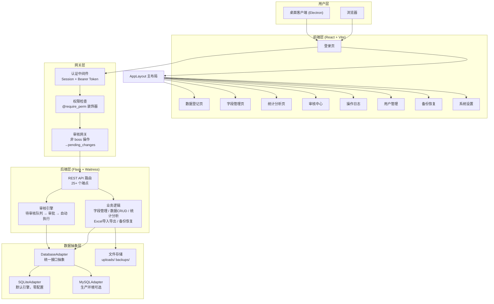
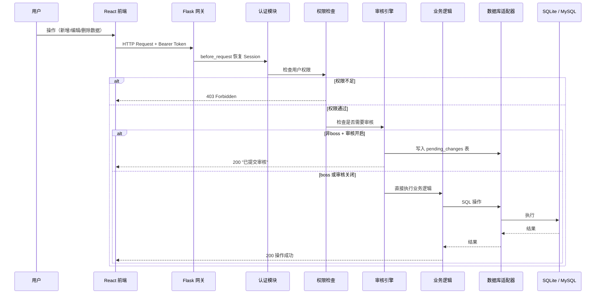
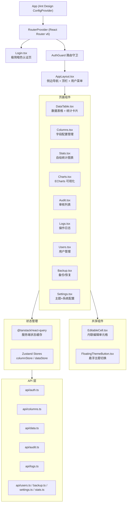
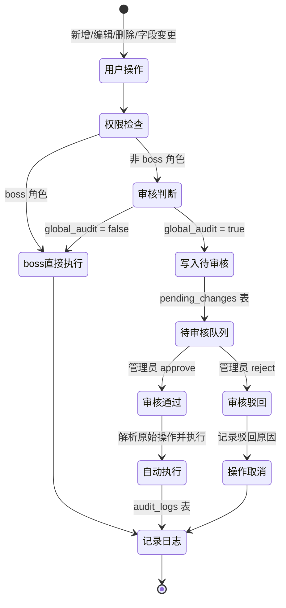
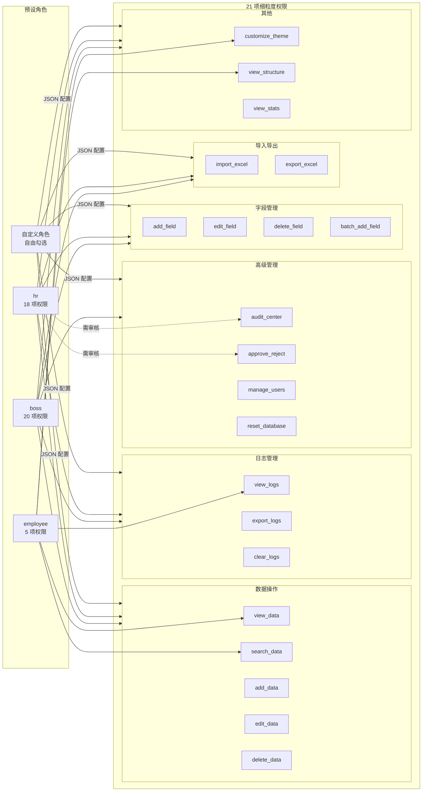

# 动态数据登记系统 — 架构图

---

## 1. 系统总体架构



---

## 2. 请求处理流程



---

## 3. 前端组件树



---

## 4. 数据库表结构 (ER 图)

```mermaid
erDiagram
    users {
        int id PK
        string username
        string password_hash
        string role
        json permissions
        bool global_audit
    }

    columns_meta {
        int id PK
        string name
        string label
        string field_type
        string options
        int order
        bool required
    }

    rows_data {
        int id PK
        string _created_by
        string _created_at
        text dynamic_columns...
    }

    pending_changes {
        int id PK
        int user_id FK
        string action_type
        text old_value
        text new_value
        string status
        string created_at
    }

    audit_logs {
        int id PK
        int user_id FK
        string action
        text detail
        string created_at
    }

    system_settings {
        int id PK
        string key
        string value
    }

    users ||--o{ pending_changes : "提交"
    users ||--o{ audit_logs : "产生"
```

---

## 5. 审核工作流



---

## 6. 部署架构

```mermaid
graph TB
    subgraph 方式1["方式一：Electron 桌面版"]
        E_Shell["Electron 壳"]
        E_Flask["Flask 子进程 :5001"]
        E_React["React SPA (static/)"]
        E_SQLite["SQLite 本地数据库"]
        E_Shell --> E_Flask
        E_Shell --> E_React
        E_Flask --> E_SQLite
    end

    subgraph 方式2["方式二：Docker Compose"]
        Nginx["Nginx :80<br/>反向代理 + 静态文件"]
        D_Flask["Flask :5001<br/>Waitress 生产模式"]
        D_MySQL["MySQL :3306<br/>生产数据库"]
        Nginx --> D_Flask
        Nginx -->|"静态文件 serve"| Static["frontend/dist/"]
        D_Flask --> D_MySQL
    end

    subgraph 方式3["方式三：PyInstaller"]
        PyApp["desktop.exe<br/>pywebview 内嵌浏览器"]
        Py_Flask["Flask 后端"]
        Py_SQLite["SQLite"]
        PyApp --> Py_Flask
        Py_Flask --> Py_SQLite
    end

    subgraph 方式4["方式四：纯 Web 部署"]
        WebBrowser["浏览器"]
        WebServer["Nginx / CDN"]
        Web_Flask["Flask 服务器"]
        Web_DB["MySQL / SQLite"]
        WebBrowser --> WebServer
        WebServer --> Web_Flask
        Web_Flask --> Web_DB
    end
```



---

## 7. 权限模型


